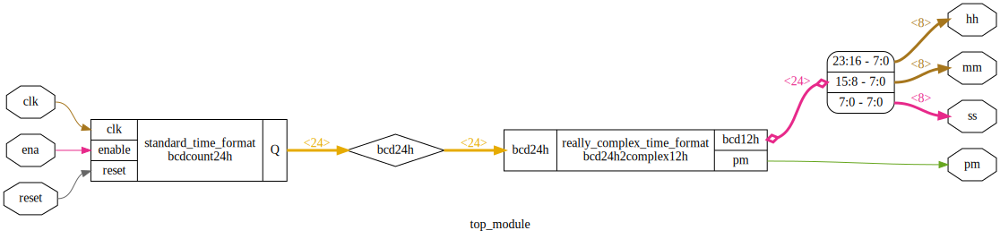

https://hdlbits.01xz.net/wiki/Count_clock

Diagram:\


Netlistsvg:\


# Requirements

iCE40HX8K-EVB board.

# Device utilisation

```
 ICESTORM_LC:   275/ 7680     3%
ICESTORM_RAM:     0/   32     0%
       SB_IO:    28/  256    10%
       SB_GB:     2/    8    25%
ICESTORM_PLL:     0/    2     0%
 SB_WARMBOOT:     0/    1     0%
```