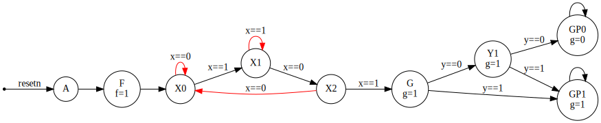
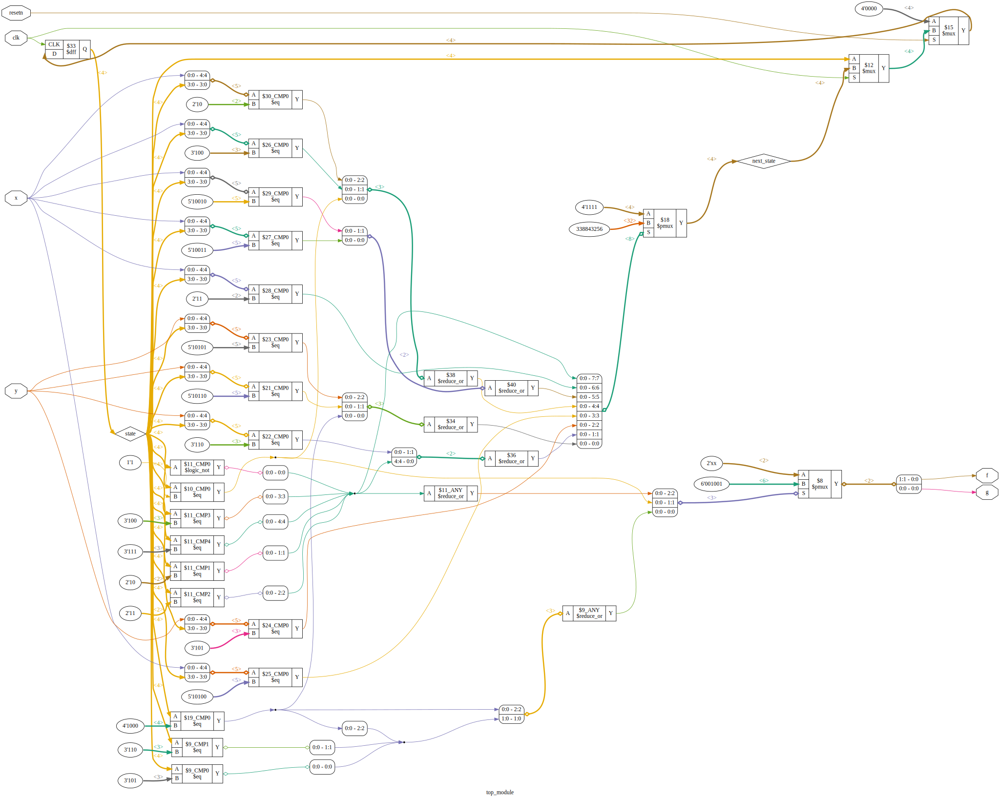

https://hdlbits.01xz.net/wiki/Exams/2013_q2bfsm

**Note to self*: *`When x has produced the values 1, 0, 1 in three successive clock cycles`*
This means that all kinds of patterns can be thrown at `x` before the correct `101` sequence appears.
After finally understanding the question I added extra states (identified by red arrows) to my state machine to pass the simulation. Those states where missing in my first tries to solve the question.

Moore Finite State Machine:\


Diagram:\


# Requirements

iCE40HX8K-EVB board.

# Device utilisation

```
 ICESTORM_LC:    20/ 7680     0%
ICESTORM_RAM:     0/   32     0%
       SB_IO:     6/  256     2%
       SB_GB:     1/    8    12%
ICESTORM_PLL:     0/    2     0%
 SB_WARMBOOT:     0/    1     0%
```