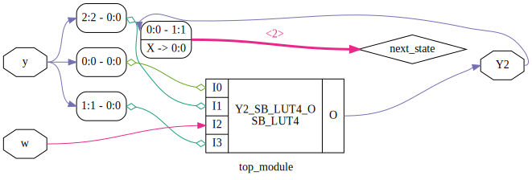

https://hdlbits.01xz.net/wiki/Exams/m2014_q6b

*Note*: answer is not implemented using the required 3 flip-flops as stated in the question. My opinion is that the requirement is not realistic. Let the syntheses tools do the work for you and synthesize the best possible solution for your maintainable code.

Question asked for 3 flip-flops. Syntheses tool required 1 LUT.

After syntheses for ice40:\


# Requirements

iCE40HX8K-EVB board.

# Device utilisation

```
 ICESTORM_LC:     2/ 7680     0%
ICESTORM_RAM:     0/   32     0%
       SB_IO:     5/  256     1%
       SB_GB:     0/    8     0%
ICESTORM_PLL:     0/    2     0%
 SB_WARMBOOT:     0/    1     0%
```