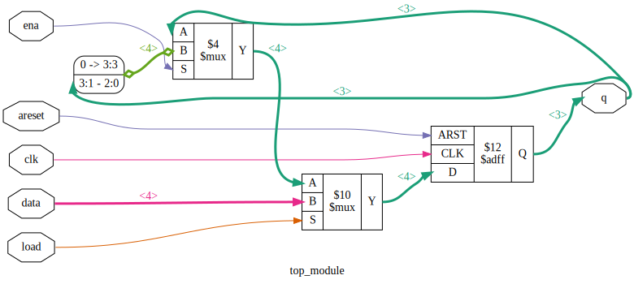

https://hdlbits.01xz.net/wiki/Shift4

Diagram:\


Netlistsvg:\


# Requirements

iCE40HX8K-EVB board.

# Device utilisation

```
 ICESTORM_LC:     7/ 7680     0%
ICESTORM_RAM:     0/   32     0%
       SB_IO:    12/  256     4%
       SB_GB:     1/    8    12%
ICESTORM_PLL:     0/    2     0%
 SB_WARMBOOT:     0/    1     0%
```