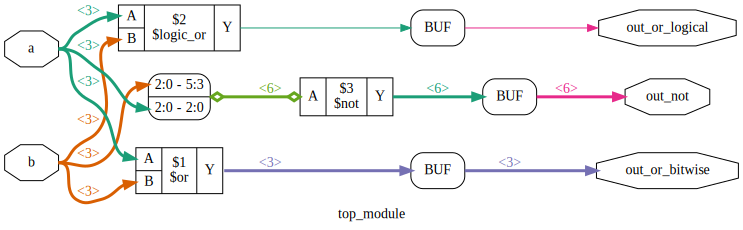

https://hdlbits.01xz.net/wiki/Vectorgates



# Requirements

iCE40HX8K-EVB board.

# Device utilisation

```
 ICESTORM_LC:    12/ 7680     0%
ICESTORM_RAM:     0/   32     0%
       SB_IO:    16/  256     6%
       SB_GB:     0/    8     0%
ICESTORM_PLL:     0/    2     0%
 SB_WARMBOOT:     0/    1     0%
```